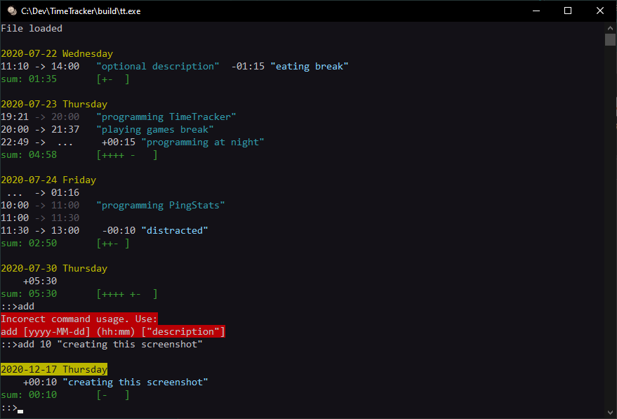
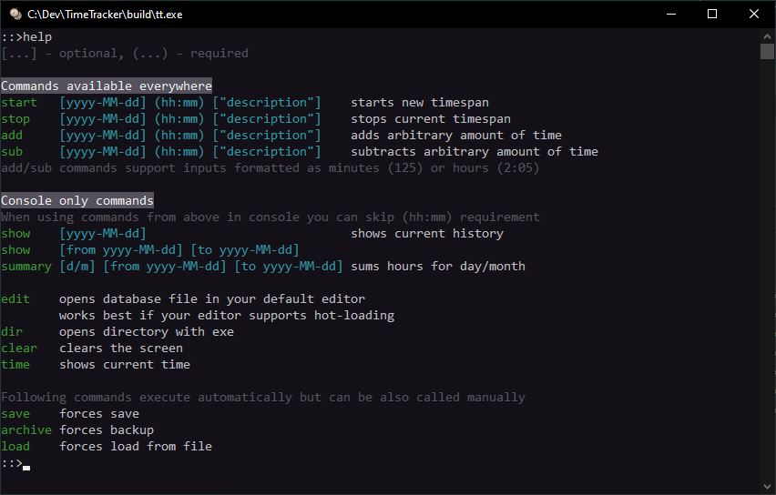

# Time Tracker

Console application designed to work with simple text file format that is easy to edit manually.  
App reads the file, validates it and reformats it with added comments.  
Data can be queried and presented in multiple ways (daily/weekly/monthly/yearly summaries + top ranking based on description topic).

Changes are saved and archived automatically.  
You can edit the file in external editor and state of the program should get automatically refreshed.  
Using text editor with hot file reloading is recommended.  


Icon based on this image: https://www.freepik.com/free-vector/hand-drawn-retro-pocket-watch_2783059.htm


### TODOs
- [.] Filtering by matching text in description
- [.] Linux version


### In action



### Example time_tracker.txt

Raw:

```
start 2020-07-22 11:10 "optional description"
sub 01:15 "eating break"
stop 14:00


start 2020-07-23 19:21 "programming TimeTracker"

// you can create new range without without using stop command
start 20:00 "playing games break" 
stop 21:37
start 22:49 "programming at night"
sub 10
add 25


// ranges that go over midnight will get counted to previous day's sum
stop 2020-07-24 01:16
start 10:00 "programming PingStats"


// this stop will get overridden with start below
stop 11:00 
start 11:00
start 11:30
sub 10 "distracted"
stop 13:00


add 2020-07-30 5:30
```


After running the program:

```
// Wednesday
start 2020-07-22 11:10 "optional description"
sub 01:15 "eating break"
stop 14:00
// sum: 01:35       [+-  ]

// Thursday
start 2020-07-23 19:21 "programming TimeTracker"
start 20:00 "playing games break"
stop 21:37
start 22:49 "programming at night"
sub 00:10
add 00:25
// sum: 04:58       [++++ -   ]

// Friday
stop 2020-07-24 01:16
start 10:00 "programming PingStats"
start 11:00
start 11:30
sub 00:10 "distracted"
stop 13:00
// sum: 02:50       [++- ]

// Thursday
add 2020-07-30 05:30
// sum: 05:30       [++++ +-  ]
```


### Help

